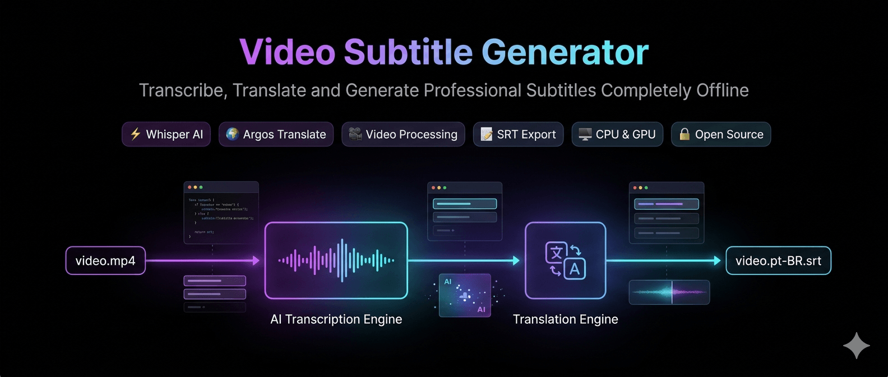

<p align="center"> 
   
</p> 
<h1 align="center">Video Subtitle Generator</h1> 
<p align="center"> 
  Transcreva vídeos e áudios com Whisper e gere legendas multilíngues automaticamente usando Argos Translate.
</p>


 
 
 
 
 
 
 
 
 


 
 
 
 


Transcreva vídeos e áudios usando OpenAI Whisper e gere legendas traduzidas automaticamente para português utilizando Argos Translate.

## Recursos

* Transcrição de vídeos e áudios
* Geração de arquivos SRT
* Geração de arquivos TXT
* Tradução automática EN → PT
* Funciona offline
* Detecção automática de CPU/GPU
* Seleção automática do modelo Whisper
* Fallback automático para CPU quando a GPU ficar sem memória
* Open Source
* Sem dependência de APIs externas

---

## Estrutura do Projeto

```text
project/
├── input/
│   └── video.mp4
│
├── output/
│
├── main.py
├── translator.py
├── requirements.txt
└── README.md
```

---

## Requisitos

### Python

Python 3.10+

### FFmpeg

#### Ubuntu

```bash
sudo apt update
sudo apt install ffmpeg -y
```

#### macOS

```bash
brew install ffmpeg
```

#### Windows

```powershell
winget install Gyan.FFmpeg
```

Verifique:

```bash
ffmpeg -version
```

---

## Instalação

### Criar ambiente virtual

```bash
python3 -m venv .venv
```

### Ativar ambiente

Linux/macOS

```bash
source .venv/bin/activate
```

Windows PowerShell

```powershell
.venv\Scripts\Activate.ps1
```

### Atualizar pip

```bash
python -m pip install --upgrade pip
```

### Instalar dependências

```bash
pip install openai-whisper
pip install argostranslate
pip install torch
```

ou

```bash
pip install -r requirements.txt
```

---

## Primeira Execução

### Apenas transcrever

```bash
python main.py input/video.mp4
```

Arquivos gerados:

```text
output/
├── video.srt
└── video.txt
```

---

### Transcrever e traduzir

```bash
python main.py input/video.mp4 \
  --translate
```

Arquivos gerados:

```text
output/
├── video.srt
├── video.txt
├── video.pt.srt
└── video.pt.txt
```

Na primeira execução o Argos Translate fará o download do pacote de tradução necessário.

---

## Modelos Whisper

| Modelo | Velocidade   | Precisão  |
| ------ | ------------ | --------- |
| tiny   | Muito rápida | Baixa     |
| base   | Rápida       | Média     |
| small  | Boa          | Boa       |
| medium | Muito boa    | Muito boa |
| large  | Mais lenta   | Excelente |

### Seleção Automática

Por padrão:

```bash
python main.py input/video.mp4
```

O sistema seleciona automaticamente o modelo mais adequado para a memória disponível.

Exemplo:

| VRAM   | Modelo |
| ------ | ------ |
| < 4 GB | base   |
| 4 GB   | small  |
| 6 GB   | medium |
| 10+ GB | large  |

---

## Exemplos

### Forçar modelo específico

```bash
python main.py input/video.mp4 \
  --model small
```

### Definir idioma de origem

```bash
python main.py input/video.mp4 \
  --language en
```

### Traduzir para português

```bash
python main.py input/video.mp4 \
  --translate \
  --target-lang pt
```

### Saída personalizada

```bash
python main.py input/video.mp4 \
  --output subtitles
```

---

## Opções

| Argumento     | Descrição                 |
| ------------- | ------------------------- |
| file          | Arquivo de vídeo ou áudio |
| --model       | Modelo Whisper            |
| --language    | Idioma de origem          |
| --translate   | Ativa tradução            |
| --target-lang | Idioma de destino         |
| --output      | Diretório de saída        |
| --verbose     | Logs detalhados           |

---

## Exemplo de Produção

```bash
python main.py \
  input/boris-cherny.mp4 \
  --model small \
  --translate \
  --target-lang pt
```

Resultado:

```text
output/
├── boris-cherny.srt
├── boris-cherny.txt
├── boris-cherny.pt.srt
└── boris-cherny.pt.txt
```

---

## Roadmap

* [ ] Faster Whisper
* [ ] Tradução em lote
* [ ] Suporte a múltiplos idiomas
* [ ] Interface Web
* [ ] Docker
* [ ] Exportação VTT
* [ ] Exportação JSON
* [ ] Pipeline para YouTube
* [ ] Integração com OpenAI
* [ ] Integração com Claude

---

## Licença

MIT License
